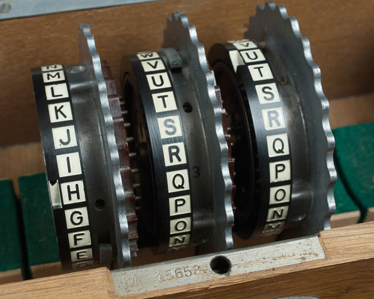

You need the key settings for rotors, their order and ring settings, the start position of the rotors,


暂时还不知道的：


        1 那3个轮子，拿出来轮子是可以转动的，不是死的
        怎么转？？为啥要转？
        2 那 5 个轮子是不是排线不一样，我觉得是


3个轮子的内部可不可以转？（不是外部有个窗口的那种转动）
 ring setting / key settings


============================

## 破解英格玛密码机 ( Crack Engima Machine to save the world )

这里有一个 Python 写的英格玛模拟器,
而你要做的是 写一个程序模拟 阿兰图灵(Alan Turing) 的 Bomba 机器,
破解德国人用 Enigma 加密的密文


<br/>
### 1. 简单介绍 (包括这段, 共x段)  
英格玛密码机 (Engima Machine) 是德国在二战期间用的机器  
作用是加密信息, 然后把加密后的信息通过无线电发出去,  
这样只有友军才知道是什么意思.  

为了更形象的了解 Enigma 的使用方法和原理, 请看视频:  

1. [數字狂 非官方繁體中文字幕]_Enigma Machine 數字狂    
https://www.youtube.com/watch?v=J46hu4RMB5I     

2. [數字狂 非官方繁體中文字幕]_Engima 的缺陷 Flaw in the Enigma Code 數字狂   
https://www.youtube.com/watch?v=Sqpe5vZoKTo   

注: 只看完这2个视频你是没法写代码实现 Enigma 的，有些细节视频里没说.    
比如   
 
1 从5个转轮里抽3个是什么意思，为什么要抽3个？(第1集的06:00)   
转轮上面不都是01~26吗？
```
    因为每个轮子内部的连线不同, 比如轮子 V(5号轮子) 当输入 3 的时候可能输出 17
    轮子 I (1号轮子) 输入 3 的时候可能输出 21
    重点是内部的对应关系不同
    注意在密码本上, 5个转轮的编号是用罗马数字表示的
    比如 I VI V 这样,
    I = 1
    II = 2
    III = 3
    VI = 4
    V = 5
    当你在密码本的 Wazlzenlage 这一列看到 V IV I
    意思是把5号轮子放左边， 4号放中间，1号放右边
```

2，字母怎么经过3个轮子然后又绕回来再次经过3个轮子？具体怎么弄的？
比如到了第3个轮子，数字是37，然后视频说又回去，那不是回到第1个轮子的时候，数字和一开始进第1个轮子的时候一样了吗？
```
有一个部件叫做 Reflecter, 作用和轮子一样, 就是输入1个数字输出对应的数字
意思就是从第3个轮子出来的数字会先进 Reflector, 然后变成另一个数字, 之后再进第3个轮子,
然后走回去, 是这样运行的

```

3. 按键是字母，轮子是数字，这之间的对应关系是什么？
因为比如你按下了P，经过插线板变成了M，下一步就应该去轮子那边了，但是M这个数字到了轮子那边怎么办？
```
A 对应 1
B 对应 2
...
Z 对应 26
```

4. PlugBoard 有10组，一组2个字母，也就是20个字母之间的对应关系，
那么还有6个字母没有连线的字母怎么弄？
```
直接进 Rotor, 不经过变换
```


<br/>
#### 补充信息:
1 密码本(codebook) 是一张纸就是一个月的


5 Engima 有其他型号的, 并不是视频里就是唯一的型号   


1 轮子不只是能转, 还能拿出来调换顺序(N多视频都有说这一点)

1 转轮不只是有数字的, 也有字母的


2 转轮有的有4个(M4型号), 并不是所有型号都是3个   
3 有其他国家觉得 Enigma 不错的, 了解之后改进了一下自己用   
5 Engima 有其他型号的, 并不是视频里就是唯一的型号   
视频里的是数字轮子, 其实还有字母轮子, 然后因为不同的型号, 有不同的密码表   


<br/>
### 玩法介绍


<br/>
### 任务


<br/>
### 补充视频
补充视频存在的意义是:   
光看前2个视频只能了解一些大概, 还有几个问题没解决，如果你想要完全理解，   
那么   

http://red-badger.com/blog/2015/02/23/understanding-the-enigma-machine-with-30-lines-of-ruby-star-of-the-2014-film-the-imitation-game/   


Enigma Extra Footage - Numberphile    
https://www.youtube.com/watch?annotation_id=annotation_509771&feature=iv&src_vid=V4V2bpZlqx8&v=BdrrJ7qd4HA    


<br/>
##### 资料来源   
http://py-enigma.readthedocs.io/en/latest/guide.html    
这是一个 Python Enigma 模拟器的文档   

How the Enigma was Set Up and Operated    
http://www.ellsbury.com/enigma3.htm  

The Enigma and the Bombe   
http://www.ellsbury.com/enigmabombe.htm   


http://users.telenet.be/d.rijmenants/en/faq.htm   
http://users.telenet.be/d.rijmenants/en/enigmaproc.htm   
https://www.youtube.com/watch?v=1__P4b_JTC4    


<br/>
### 其他推荐


艾倫・圖靈：生平與功績簡介（中文字幕） Alan Turing: biography and achievements    
https://www.youtube.com/watch?v=ANK8-poUDiI     
<br/>

WWII Enigma Machine: The Enigma Project    
https://www.youtube.com/watch?v=elYw4Ve4F-I    

<br/>

Bletchley Park: The Enigma Machine     
https://www.youtube.com/watch?v=faRfab9Yyk8   

<br/>

Imitation Game: how did the Enigma machine work?  (2分钟26秒)   
https://www.youtube.com/watch?v=TYX691q2J2c    
推荐理由: 这个视频里介绍了其他视频都跳过不讲的 Reflecter    

<br/>

Enigma - The True Story (6分49秒)(UnknownHistory - BitmapAxis)   
https://www.youtube.com/watch?v=2OcC-8zUUEc   

<br/>

Lorenz: Hitler's "Unbreakable" Cipher Machine (11分钟42秒)(singingbanana)    
https://www.youtube.com/watch?v=GBsfWSQVtYA    
推荐理由: 这个不是讲 Enigma, 是讲 Lorenz    

     
<br/>
Turing's Enigma Problem (Part 1) - Computerphile (18分钟59秒)  
https://www.youtube.com/watch?v=d2NWPG2gB_A  
推荐理由:      
1 插线板部分, 字母和数字的对应, 拍摄的很清晰     
2 讲清楚了如果插线板没插线, 那么字母不会变, 原样送到 rotor, 以及一般是插10组，而不是13组全部插满.    


  
<br/> 
### 最后  
欢迎写其他语言的 Enigma 模拟器 或是 Bomba 然后提交到这个库(fork&pull request)  

(记得写代码注释, 
文件开头 5,6 行写上你的名字和写这份代码的时间, 
可能需要的依赖库以及版本之类的,  
以及其他你觉得需要宣传的东西)  

或者你也可以写了之后放在自己的 Github 公开库, 开个 issue 告诉我,   
然后我在这份 README 里面写上你 Github 库的链接  


3 图片里的最后一列，是什么？

Kenngruppen: special text fragments that should be transmitted to identify the transmitter’s key settings to any receiver. This is also known as the message indicator.
最后一列特殊信息会嵌入到最终发出的加密信息的一个固定区域里，
用于唯一标示发送者的机器设定.
当别人收到信息的时候，就根据固定格式，找到最后那一列的信息, 然后查表,
来确定是昨天的信息还是刚刚发的, 或者是2天前的信息.
然后根据那一天的设定来解码信息

总结重点就是：当收到信息时，根据最后一列信息比对，从而得知信息是哪一天的信息，
然后查表调整到对应设定，这样才能解密剩下的信息。

为什么能收到昨天甚至是前天的信息？？？