<!-- 
    轮子本身可以转
    Cracking the NAZI Enigma Code Machine
    https://www.youtube.com/watch?v=Hb44bGY2KdU

    那么什么时候需要转???
    解决了这个再说
 -->

 TODO: 图片全部加上来源和时间和场景?

## 破解英格玛密码机 ( Crack Engima Machine to save the world )
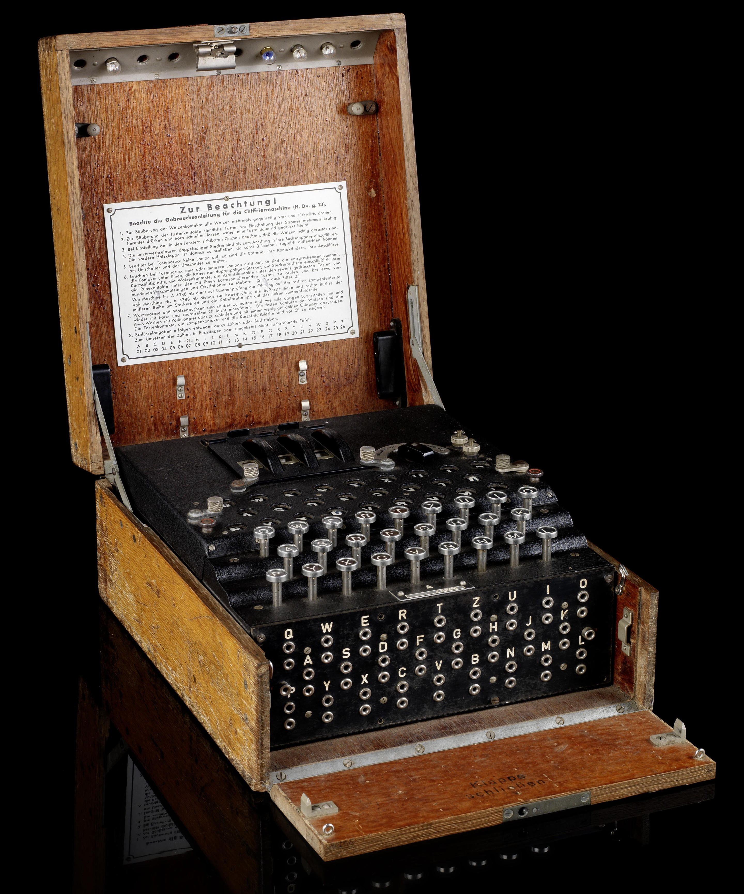  
这里有一个 Python 写的英格玛模拟器   
而你要做的是写程序模拟 [阿兰图灵(Alan Turing)](https://en.wikipedia.org/wiki/Alan_Turing) 的 [Bombe 机器](https://en.wikipedia.org/wiki/Bombe),  
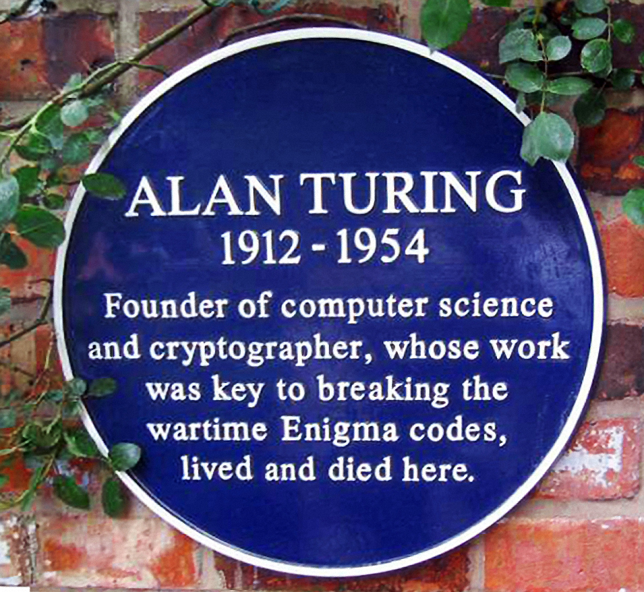    
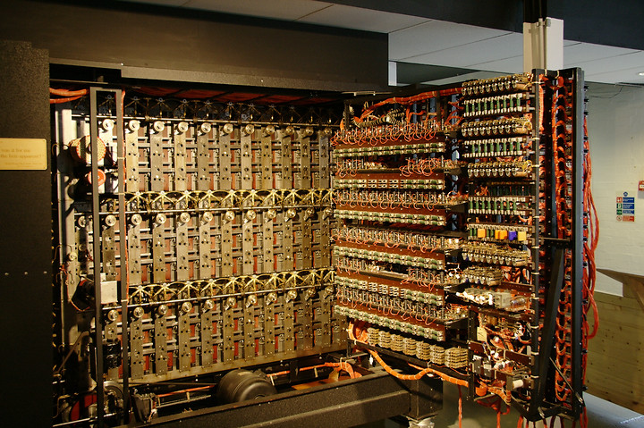  
> 免责声明: 波兰人也做了很多努力, 这里不是将功劳全部推给图灵一个人  
> 1932 年波兰人开始试着破解 Enigma, 后来当德国人入侵波兰之后  波兰把他们的工作给了法国和英国人  
> 波兰不但是破解 Enigma 的先驱尝试者, 而且使得其他人相信 Engima 不是不可破解的    
> (资料来源:  http://users.telenet.be/d.rijmenants/en/enigma.htm   [Breaking the code] Section)    

破解德国人用 Enigma 加密的密文  
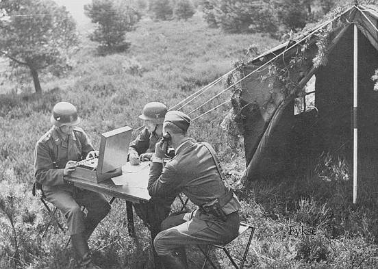  
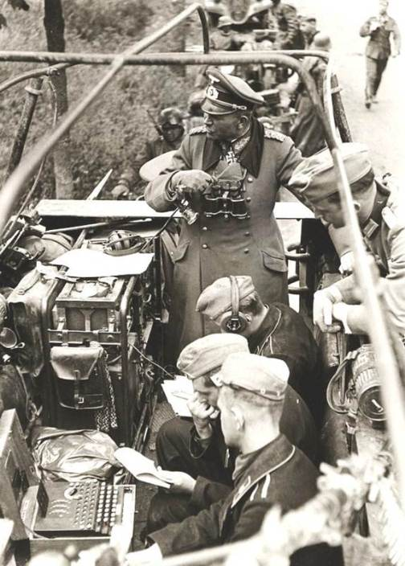  


<br/>
### 1. 简单介绍 
英格玛密码机 (Engima Machine) 是德国二战期间用的机器  
作用是加密信息, 然后把加密后的信息通过无线电发出去, 这样只有友军才知道是什么意思.    
> 整场二战德国人都不知道他们的 Enigma 加密被破解了     
> (原句: The large scale breaking of German communications was one of the best kept secret of the Second World War. German armed forces kept on using Enigma during the entire war without any suspicion)  
> (资料来源:  http://users.telenet.be/d.rijmenants/en/enigma.htm  [Turning the tide] Section 最后一段)  

为了更形象的了解 Enigma 的使用方法和原理, 请看视频:  

| 标题 | 链接 |
|------|------|
|  [數字狂 非官方繁體中文字幕]_Enigma Machine 數字狂   |  https://www.youtube.com/watch?v=J46hu4RMB5I      |
|  [數字狂 非官方繁體中文字幕]_Engima 的缺陷 Flaw in the Enigma Code 數字狂   | https://www.youtube.com/watch?v=Sqpe5vZoKTo    |


<br/>
<br/>
#### 注
只看这 2 个视频你是没法写代码实现 Enigma 模拟器的,   
有些细节视频里没说, 比如   
   
 
1. 从 5 个转轮里抽 3 个是什么意思，为什么要抽 3 个？(第1集的06:00)   
转轮上面不都是 01~26 吗？
```
    因为每个轮子内部的连线不同, 比如轮子 V(5号轮子) 当输入 3 的时候可能输出 17
    轮子 I (1号轮子) 输入 3 的时候可能输出 21
    重点是内部的对应关系不同

    注意在密码本上, 5个转轮的编号是用罗马数字表示的
    比如 I VI V 这样,
    I = 1
    II = 2
    III = 3
    VI = 4
    V = 5
    当你在密码本的 Wazlzenlage 这一列看到 V IV I
    意思是把5号轮子放左边， 4号放中间，1号放右边
```
看下图的 I, II, III, IV, V  
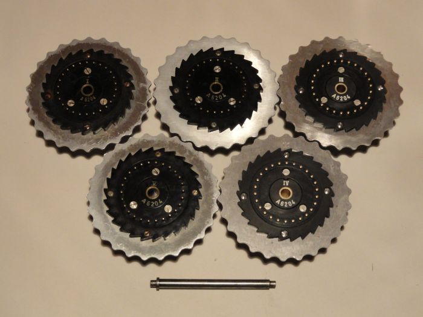   
注意轮子有两面, 下图是翻到了另外一面所以没有罗马数字编号  
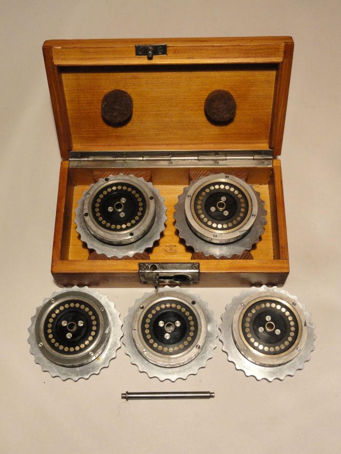    
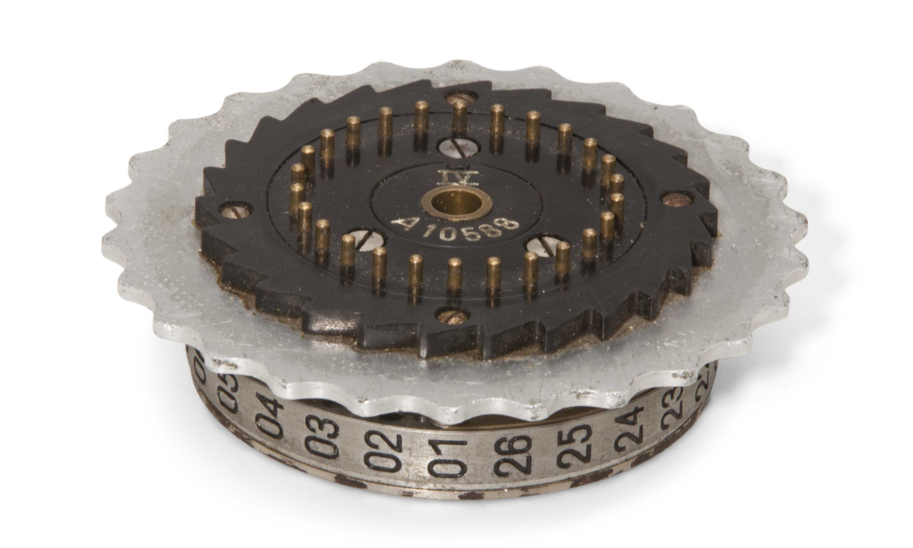   


2.  字母怎么经过 3 个轮子然后又绕回来, 再次经过 3 个轮子？具体怎么弄的？  
比如到了第3个轮子，数字是37，然后视频说又回去  
那不是回到第1个轮子的时候，数字和一开始进第1个轮子的时候一样了吗？
```
    有一个部件叫做 Reflecter, 作用和轮子一样, 就是输入1个数字输出对应的数字
    意思就是从第3个轮子出来的数字会先进 Reflector, 然后变成另一个数字, 之后再进第3个轮子,
    然后走回去, 是这样运行的
    
```

3. 按键是字母，轮子是数字，这之间的对应关系是什么？  
因为比如你按下了P，经过插线板变成了M，下一步就应该去轮子那边了，但是M这个数字到了轮子那边怎么办？  
```
    A 对应 1
    B 对应 2
    C 对应 3
    D 对应 4
    ...
    Z 对应 26
```
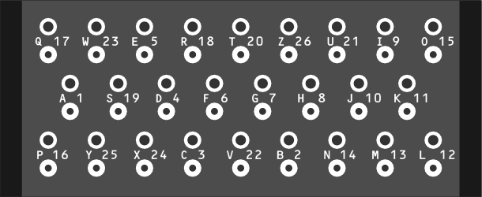
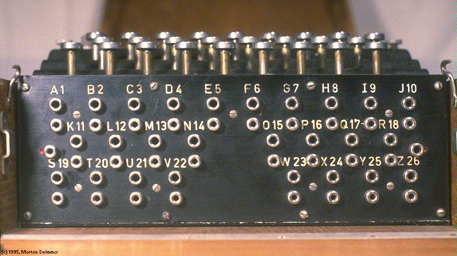  
上面两张图你可以看到只是排布方式不一样，字母和数字之间的对应是一样的  


4. PlugBoard 有10组，一组2个字母，也就是20个字母之间有对应关系,    
那么还有6个字母没有连线的字母怎么弄?    
```
    直接进 Rotor, 不经过变换
```
证明:   
Turing's Enigma Problem (Part 1) - Computerphile (18分钟59秒)   
https://www.youtube.com/watch?v=d2NWPG2gB_A  
讲清楚了如果插线板没插线, 那么字母不会变, 原样送到 rotor, 以及一般是插10组，而不是13组全部插满.  

<br/>
<br/>
### 2. 补充信息:
1 密码本(codebook) 是一张纸就是一个月的


2 轮子不只是能转, 还能拿出来调换顺序

<br/>
3 转轮不只是有数字的, 也有字母的  
  

<br/>
4 Engima 有其他型号的, 并不是视频里就是唯一的型号      
  

<br/>
5 并不是所有型号都是3个转轮, 有的有4个(M4型号), 有的有8个(海军用的这个)    
https://en.wikipedia.org/wiki/Enigma_rotor_details  
https://en.wikipedia.org/wiki/Enigma_machine   
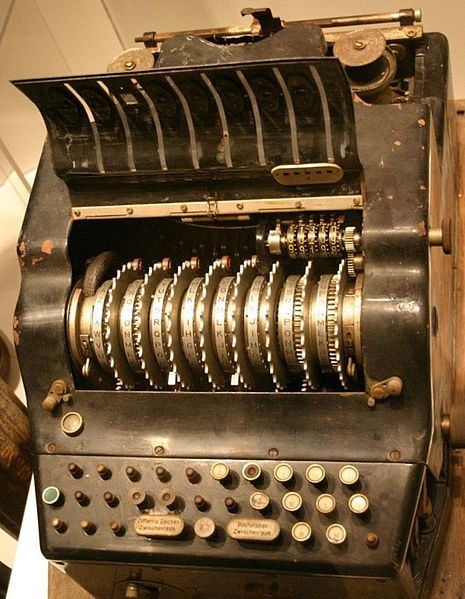
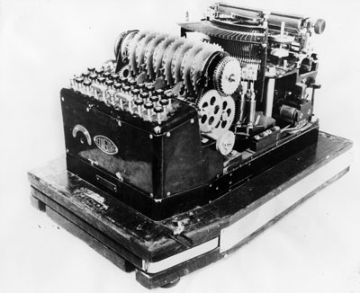


<br/>
### 任务
暂时空


<br/>
### 资料来源
  
| 序号 | 链接 |
|------|------|
|  1  |  http://red-badger.com/blog/2015/02/23/understanding-the-enigma-machine-with-30-lines-of-ruby-star-of-the-2014-film-the-imitation-game/    |
|  2  |   Enigma Extra Footage - Numberphile  <br/>  https://www.youtube.com/watch?annotation_id=annotation_509771&feature=iv&src_vid=V4V2bpZlqx8&v=BdrrJ7qd4HA    |
|  3  |  一个 Python Enigma 模拟器的文档 <br/>  http://py-enigma.readthedocs.io/en/latest/guide.html       |
|  4  |  How the Enigma was Set Up and Operated   <br/>  http://www.ellsbury.com/enigma3.htm      |
|  5  |   The Enigma and the Bombe  <br/> http://www.ellsbury.com/enigmabombe.htm    |
|  6  |  这里有很多很多相关资料 <br/> http://users.telenet.be/d.rijmenants/en/faq.htm    |
|  7  |  http://users.telenet.be/d.rijmenants/en/enigmaproc.htm     |
|  8  |   Enigma Demo(2分16秒)  <br/> https://www.youtube.com/watch?v=1__P4b_JTC4      |
|  9  |   艾倫・圖靈：生平與功績簡介（中文字幕） Alan Turing: biography and achievements  <br/> https://www.youtube.com/watch?v=ANK8-poUDiI   |
|  10 |   WWII Enigma Machine: The Enigma Project  <br/>https://www.youtube.com/watch?v=elYw4Ve4F-I     |
|  11  |   Bletchley Park: The Enigma Machine  <br/> https://www.youtube.com/watch?v=faRfab9Yyk8      |
|  12 |   Imitation Game: how did the Enigma machine work?  (2分钟26秒)<br/> https://www.youtube.com/watch?v=TYX691q2J2c  <br/>   推荐理由: 这个视频里介绍了其他视频都跳过不讲的 Reflecter  <br/>    |
|  13  |   Enigma - The True Story (6分49秒)(UnknownHistory - BitmapAxis)  <br/> https://www.youtube.com/watch?v=2OcC-8zUUEc   |
|  14  |   Lorenz: Hitler's "Unbreakable" Cipher Machine (11分钟42秒)(singingbanana)    <br/> https://www.youtube.com/watch?v=GBsfWSQVtYA <br/> 推荐理由: 这个不是讲 Enigma, 是讲 Lorenz      |
|  15  |   Turing's Enigma Problem (Part 1) - Computerphile (18分钟59秒) <br/>https://www.youtube.com/watch?v=d2NWPG2gB_A  <br/> 推荐理由:      <br/> 1 插线板部分, 字母和数字的对应, 拍摄的很清晰      <br/> 2 讲清楚了如果插线板没插线, 那么字母不会变, 原样送到 rotor, 以及一般是插10组，而不是13组全部插满.     |
|  16  |   Crypto Museum  <br/> http://cryptomuseum.com/crypto/enigma/m4/index.htm <br/>推荐理由:  图片多 |
|  17  |  http://ciphermachines.com/enigma |
|  18  |  https://plus.maths.org/content/exploring-enigma  |
|  19  |   Cracking the NAZI Enigma Code Machine  <br/> https://www.youtube.com/watch?v=Hb44bGY2KdU   |
|  20  |   Alan Turing - Enigma And The Bombe, Part 1 <br/> https://www.youtube.com/watch?v=RYbTeqRs5fA  |


<br/> 
### 单词  
如果你感兴趣并且去查相关资料, 那么你可能会看到这几个词     
__Wehrmacht, Luftwaffe and Kriegsmarine__    

https://en.wikipedia.org/wiki/Wehrmacht  
根据维基百科   

The Wehrmacht  was the unified armed forcesof Nazi Germany from 1935 to 1946.  
It consisted of the Heer (army), the Kriegsmarine (navy) and the Luftwaffe(air force).   
简单说就是 __Wehrmacht 是德国军队的总称__     
而__陆军是 Heer__, __海军是 Kriegsmarine__, __空军是 Luftwaffe__    


<br/> 
### 最后  
欢迎写其他语言的 Enigma 模拟器 或是 Bomba 然后提交到这个库(fork&pull request)  
(注意 Enigma 有很多型号, 你得自己选一个型号写, 如果写兼容所有型号的会很花时间)
(记得写代码注释, 
文件开头 5,6 行写上你的名字和写这份代码的时间, 
可能需要的依赖库以及版本之类的,  
以及其他你觉得需要宣传的东西)  

或者你也可以写了之后放在自己的 Github 公开库, 开个 issue 告诉我,   
然后我在这份 README 里面写上你 Github 库的链接  

<br/>


<!-- 
3 图片里的最后一列，是什么？

Kenngruppen: special text fragments that should be transmitted to identify the transmitter’s key settings to any receiver. This is also known as the message indicator.
最后一列特殊信息会嵌入到最终发出的加密信息的一个固定区域里，
用于唯一标示发送者的机器设定.
当别人收到信息的时候，就根据固定格式，找到最后那一列的信息, 然后查表,
来确定是昨天的信息还是刚刚发的, 或者是2天前的信息.
然后根据那一天的设定来解码信息

总结重点就是：当收到信息时，根据最后一列信息比对，从而得知信息是哪一天的信息，
然后查表调整到对应设定，这样才能解密剩下的信息。

为什么能收到昨天甚至是前天的信息？？？


 -->